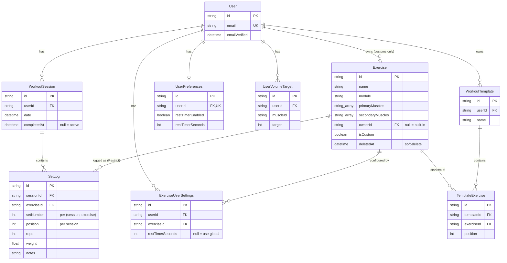

# Data model

The persistence layer of the workout tracker. This doc covers the **shape** of the data: what entities exist, what role each plays, how they relate. Field-level definitions, constraints, and indexes live in [`prisma/schema.prisma`](../prisma/schema.prisma) — that's the source of truth, and copying field lists here would just create something to go stale.

For schema-editing operational guidance (migrations, seed compilation, things-that-would-be-wrong), see [`prisma/CLAUDE.md`](../prisma/CLAUDE.md).

## Entity overview

Twelve models, in three groups:

| Group | Models | Notes |
|---|---|---|
| Auth.js adapter tables | `User`, `Account`, `AuthSession`, `VerificationToken` | Managed by the `@auth/prisma-adapter`. The app reads `User.id` to scope everything; the rest is opaque infrastructure. |
| Core domain | `Exercise`, `WorkoutSession`, `SetLog` | The spine of the app. Every workout is a session containing setLogs that reference exercises. |
| User-customization layer | `ExerciseUserSettings`, `UserVolumeTarget`, `UserPreferences`, `WorkoutTemplate`, `TemplateExercise` | Per-user preferences, per-(user, exercise) overrides, and saved workout lineups. |

## Diagram

The relationships between the core domain and customization-layer models. Auth.js tables omitted — they only relate to `User`.



A pre-rendered PDF of this diagram is committed alongside this doc at [`data-model.pdf`](./data-model.pdf) for offline / print viewing. Regenerate it with `npx mmdc -i docs/data-model.md -o docs/data-model.pdf` after schema changes. (The Mermaid block in this markdown file is the source of truth — most viewers, including GitHub, render it inline. The PDF is for situations where Mermaid isn't available.)

## The core domain

### `Exercise`

A movement the user can log sets against. **One model serves both built-in and custom exercises** — the distinction is `ownerId`:

- `ownerId` null → built-in, shared across all users, comes from `lib/exercises-data.ts` via the seed.
- `ownerId` set → custom, scoped to that user.

This unification is deliberate. It lets the picker show built-ins and customs in one list, and lets `requireAvailableExercise()` do one ownership check covering both: `OR: [{ ownerId: null }, { ownerId: userId }]`. See [`prisma/CLAUDE.md`](../prisma/CLAUDE.md) for why we don't split them into separate models.

Key behaviors:

- **Soft-delete via `deletedAt`.** When a user removes a custom, the row stays — historical SetLogs still reference it. All exercise-listing queries must filter `deletedAt: null`.
- **Multi-muscle credit, weighted.** `primaryMuscles[]` count 1.0 per set toward volume; `secondaryMuscles[]` count 0.5. Coverage (recency) treats them equally — see [`docs/decisions.md`](./decisions.md).
- **`module` is a tag, not a constraint.** Exercises group visually under `Activation Lower`, `Strength Barbell`, etc., but modules don't drive session structure.

### `WorkoutSession`

A user's training session — a date plus a `completedAt`. **Sessions are records, not plans.** There's no "type of day" stored. See [root CLAUDE.md](../CLAUDE.md) for the philosophical stance and [`docs/decisions.md`](./decisions.md) for why we deliberately rejected `dayFocus`.

Key behaviors:

- **`completedAt` is the lifecycle bit.** Null means in-progress (active). Set means done.
- **At most one active session per user.** App-enforced, not DB-enforced — see [`docs/decisions.md`](./decisions.md) for why.
- **Auto-cleanup when emptied.** If `removeSet` or `removeExerciseFromActiveSession` empties the session, the session itself gets deleted. Avoids the "phantom in-progress workout" UX.

### `SetLog`

The log entry for one set of one exercise inside one session. Most-frequently-written model; the volume metric (`metrics.setsLogged`) increments per row.

Key behaviors:

- **Two ordering fields with different scopes.** `setNumber` is contiguous from 1 within `(sessionId, exerciseId)` — used for "set 1, set 2, set 3 of the deadlift." `position` is the order of the *exercise* within the session, shared by every SetLog of that exercise. Don't mix them.
- **`Restrict` on the Exercise relation, not Cascade.** A user can soft-delete a custom exercise even when historical SetLogs reference it; the soft-delete preserves history. A literal hard-delete would be blocked at the DB level.
- **`notes` is per-set freeform text.** Surfaced in the "last time" reference next session. Empty stored as null.

## The customization layer

### `WorkoutTemplate` + `TemplateExercise`

A user-named, reusable lineup of exercises in chosen order. Saving captures only the exercises and order — not the logged sets. Loading pre-populates the active session with one empty SetLog per exercise.

`TemplateExercise` is the junction row with a `position` field. If the source `Exercise` is later (hard-)deleted, the junction goes with it (Cascade) — the template degrades gracefully. In practice exercises soft-delete, so this only fires for built-ins.

### `ExerciseUserSettings`

Per-(user, exercise) overrides. Currently just `restTimerSeconds` (the per-exercise rest override; null/missing = use the global default). The table exists rather than putting the override on `Exercise` directly because users override built-ins all the time and we don't want to fork them.

A missing row means "no overrides" — same data as a row of all nulls. Both states are valid; the app treats them identically.

### `UserVolumeTarget`

Per-(user, muscle) override of the weekly volume target. Default targets live as compile-time data in `lib/exercises-data.ts`'s `MUSCLE_GROUPS`; this table is for users who want to tune them.

`muscleId` is a free-text string matching a key in `MUSCLE_GROUPS` (e.g. `'glutes'`, `'rear delts'`). The schema doesn't enforce a foreign key to a muscles table because there is no muscles table — the muscle list is application code, not data. See [`docs/decisions.md`](./decisions.md) for why muscles aren't a model.

### `UserPreferences`

One row per user, **lazily created on first write**. The query `getUserPreferences()` returns hard-coded defaults when no row exists, so reading is cheap on every page load and we only write when something actually changes.

The fields are all rest-timer related right now (`restTimerEnabled`, `restTimerSeconds`, `restTimerSound`, `restTimerVibrate`). Future preferences (units, theme, notification settings) would slot in here.

## Auth.js tables

`User`, `Account`, `AuthSession`, and `VerificationToken` are managed by the `@auth/prisma-adapter`. The app:

- **Reads `User.id`** as the userId that scopes every other query.
- **Reads `User.name` and `User.email`** for the greeting handle in the layout.
- **Treats the rest as opaque** — never reads `Account.refresh_token`, never queries `AuthSession` directly (we use JWT sessions), never touches `VerificationToken`.

If you find yourself wanting to query these tables for application purposes, that's a smell — the Auth.js library should mediate. Documented in Auth.js's docs, not here.

## Cross-cutting patterns

A few patterns show up across multiple models. Recognizing them on sight saves time.

**Ownership scoping.** Every app-domain row has either a direct `userId` or reaches one through a relation in two hops or fewer (`SetLog.session.userId`, `TemplateExercise.template.userId`). Every query and action filters by `userId` from the authed session. Never trust a userId from input.

**Soft-delete on `Exercise`.** Only `Exercise` has `deletedAt`. No other model uses soft-delete. The seed script intentionally clears `deletedAt` on built-ins it touches, so a built-in that was somehow soft-deleted gets restored on the next seed run.

**`onDelete: Cascade` is the default; `Restrict` is the exception.** Almost every relation cascades from `User` and from container models. The only `Restrict` is `SetLog.exercise` — preserving the invariant that a logged set always points at an exercise row.

**Lazy default rows.** `UserPreferences` is created on first write, not first read. The query returns defaults when no row exists. This pattern would extend cleanly to any future "one row per user" preference table.

**`muscleId` is a string, not a foreign key.** Muscles are application data (`lib/exercises-data.ts`), not a database table. `Exercise.primaryMuscles[]`, `Exercise.secondaryMuscles[]`, and `UserVolumeTarget.muscleId` all use string keys that the app code knows how to interpret. Custom exercises can in principle reference any string — the picker UI constrains the choices, but the schema doesn't.

**The "active session" convention.** The most user-visible invariant: at most one `WorkoutSession` per user with `completedAt: null` at any time. App-enforced via `findActiveSession()` ordered by date desc. See [`docs/decisions.md`](./decisions.md) for why we don't enforce it via a partial unique index.

## When this doc goes stale

If you change `prisma/schema.prisma` and the relationships shown here no longer match, update both this doc *and* regenerate the rendered PDF:

```bash
npx mmdc -i docs/data-model.md -o docs/data-model.pdf
```

(`mmdc` extracts the first Mermaid block from the markdown — that's the ER diagram block above.)

If you find this doc says something the schema doesn't, or vice versa, the schema wins. Update the doc as part of the same change.
