# Data model

The persistence layer of the workout tracker. This doc covers the **shape** of the data: what entities exist, what role each plays, how they relate. Field-level definitions, constraints, and indexes live in [`prisma/schema.prisma`](../prisma/schema.prisma) — that's the source of truth, and copying field lists here would just create something to go stale.

For schema-editing operational guidance (migrations, seed compilation, things-that-would-be-wrong), see [`prisma/CLAUDE.md`](../prisma/CLAUDE.md).

## Entity overview

Five groups of models:

| Group                           | Models                                                                                                                     | Notes                                                                                                                                                                        |
| ------------------------------- | -------------------------------------------------------------------------------------------------------------------------- | ---------------------------------------------------------------------------------------------------------------------------------------------------------------------------- |
| Auth.js adapter tables          | `User`, `Account`, `AuthSession`, `VerificationToken`                                                                      | Managed by the `@auth/prisma-adapter`. The app reads `User.id` to scope everything; the rest is opaque infrastructure.                                                       |
| Core domain                     | `Exercise`, `WorkoutSession`, `SetLog`                                                                                     | The spine of the app. Every workout is a session containing setLogs that reference exercises.                                                                                |
| User-customization layer        | `ExerciseUserSettings`, `UserVolumeTarget`, `UserPreferences`, `Band`, `WorkoutTemplate`, `TemplateExercise`, `TemplatePool`, `UserHiddenTemplate` | Per-user preferences, per-(user, exercise) overrides, the user's resistance-band list, saved workout lineups, "pick X of N" pools, and per-user hide markers for built-in templates.              |
| Routines                        | `Routine`, `RoutineDay`, `RoutineDayPendingSwap`                                                                           | The user's named cycle of templates and any one-time substitutions staged for upcoming days. Capped at 7 days per routine.                                                   |
| Routine sharing + notifications | `RoutineShare`, `ShareReviewer`, `ShareComment`, `ShareSuggestion`, `ShareReaction`, `Notification`                        | Owner-minted share links, anonymous-by-cookie reviewer identities, and the in-app inbox the owner reviews. See [decisions.md](./decisions.md) for the philosophical framing. |

## Diagram

The relationships between the core domain and customization-layer models. Auth.js tables omitted — they only relate to `User`.

```mermaid
erDiagram
    User ||--o{ Exercise : "owns (customs only)"
    User ||--o{ WorkoutSession : has
    User ||--o| UserPreferences : has
    User ||--o{ UserVolumeTarget : has
    User ||--o{ ExerciseUserSettings : has
    User ||--o{ WorkoutTemplate : "owns (user templates)"
    User ||--o{ UserHiddenTemplate : "hides built-ins"
    User ||--o| Routine : has

    WorkoutSession ||--o{ SetLog : contains
    WorkoutSession }o--|| RoutineDay : "started from (optional)"
    Exercise ||--o{ SetLog : "logged as (Restrict)"
    Exercise ||--o{ ExerciseUserSettings : "configured by"
    Exercise ||--o{ TemplateExercise : "appears in"
    Exercise ||--o{ RoutineDayPendingSwap : "swapped in/out"

    WorkoutTemplate ||--o{ TemplateExercise : contains
    WorkoutTemplate ||--o{ TemplatePool : "groups (pick X of N)"
    WorkoutTemplate ||--o{ UserHiddenTemplate : "hidden by"
    WorkoutTemplate ||--o{ RoutineDay : "scheduled in"
    TemplatePool ||--o{ TemplateExercise : "members (SetNull)"

    Routine ||--o{ RoutineDay : has
    RoutineDay ||--o{ RoutineDayPendingSwap : "stages"

    User {
        string id PK
        string email UK
    }
    Exercise {
        string id PK
        string ownerId FK "null = built-in"
        datetime deletedAt "soft-delete"
    }
    WorkoutSession {
        string id PK
        string userId FK
        datetime completedAt "null = active"
    }
    SetLog {
        string id PK
        string sessionId FK
        string exerciseId FK "Restrict, not Cascade"
        int setNumber "per (session, exercise)"
        int position "per session"
    }
    WorkoutTemplate {
        string id PK
        string userId FK "null = built-in"
        boolean isBuiltin
    }
    UserHiddenTemplate {
        string userId FK
        string templateId FK
    }
    TemplateExercise {
        string templateId FK
        string exerciseId FK "Cascade"
        string poolId FK "null = fixed slot, SetNull"
        int position "contiguous; pool members blocked"
    }
    TemplatePool {
        string id PK
        string templateId FK "Cascade"
        int pickCount "X of N"
    }
    ExerciseUserSettings {
        string userId FK
        string exerciseId FK
    }
    UserVolumeTarget {
        string userId FK
        string muscleId "no FK; muscles live in code"
    }
    UserPreferences {
        string userId FK,UK
    }
    Routine {
        string userId FK,UK
        string scheduleStyle "sequence | weekday"
        int lastCompletedPosition "sequence-mode cursor"
    }
    RoutineDay {
        string routineId FK
        string templateId FK
        int position "unique per routine"
        int weekday "unique per routine, null in sequence mode"
    }
    RoutineDayPendingSwap {
        string routineDayId FK
        string outExerciseId FK
        string inExerciseId FK
    }
```

The Mermaid block above is the source of truth — GitHub and most viewers render it inline. (`docs/data-model.pdf` exists as a leftover from when we mirrored to PDF; it's not part of the maintenance contract anymore.)

## The core domain

### `Exercise`

A movement the user can log sets against. **One model serves both built-in and custom exercises** — the distinction is `ownerId`:

- `ownerId` null → built-in, shared across all users, comes from `lib/exercises-data.ts` via the seed.
- `ownerId` set → custom, scoped to that user.

This unification is deliberate. It lets the picker show built-ins and customs in one list, and lets `requireAvailableExercise()` do one ownership check covering both: `OR: [{ ownerId: null }, { ownerId: userId }]`. See [`prisma/CLAUDE.md`](../prisma/CLAUDE.md) for why we don't split them into separate models.

Key behaviors:

- **Soft-delete via `deletedAt`.** When a user removes a custom, the row stays — historical SetLogs still reference it. All exercise-listing queries must filter `deletedAt: null`.
- **Multi-muscle credit, weighted.** `primaryMuscles[]` count 1.0 per set toward volume; `secondaryMuscles[]` count 0.5. Coverage (recency) treats them equally — see [`docs/decisions.md`](./decisions.md).
- **`module` is a tag, not a constraint.** Exercises group visually under `Activation Lower`, `Strength Barbell`, etc., but modules don't drive session structure.
- **`loadType` decides the load input shape.** `'weight'` (default) shows the numeric stepper, `'band'` swaps to a chip picker of the user's `Band` rows, `'none'` hides the load column entirely (mobility / SMR / bodyweight balance work). Independent of `metric` — a `loadType='none'` exercise can still be reps or time.

### `WorkoutSession`

A user's training session — a date plus a `completedAt`. **Sessions are records, not plans.** There's no "type of day" stored. See [`docs/decisions.md`](./decisions.md) for why we deliberately rejected `dayFocus`.

Key behaviors:

- **`completedAt` is the lifecycle bit.** Null means in-progress (active). Set means done.
- **At most one active session per user.** App-enforced, not DB-enforced — see [`docs/decisions.md`](./decisions.md) for why.
- **Auto-cleanup when emptied.** If `removeSet` or `removeExerciseFromActiveSession` empties the session, the session itself gets deleted. Avoids the "phantom in-progress workout" UX.

### `SetLog`

The log entry for one set of one exercise inside one session. Most-frequently-written model; the volume metric (`metrics.setsLogged`) increments per row.

Key behaviors:

- **Two ordering fields with different scopes.** `setNumber` is contiguous from 1 within `(sessionId, exerciseId)` — used for "set 1, set 2, set 3 of the deadlift." `position` is the order of the _exercise_ within the session, shared by every SetLog of that exercise. Don't mix them.
- **`Restrict` on the Exercise relation, not Cascade.** A user can soft-delete a custom exercise even when historical SetLogs reference it; the soft-delete preserves history. A literal hard-delete would be blocked at the DB level.
- **`weight` and `bandId` are mutually exclusive.** The exercise's `loadType` dictates which is meaningful: `'weight'` → numeric weight, `'band'` → bandId, `'none'` → both null. `updateSet` clears `weight` when `bandId` is set so the two never both populate. `SetLog.bandId` is `SetNull` on Band delete so history survives.
- **`notes` is per-set freeform text.** Surfaced in the "last time" reference next session. Empty stored as null.

## The customization layer

### `WorkoutTemplate` + `TemplateExercise`

A named, reusable lineup of exercises in chosen order. Saving captures only the exercises and order — not the logged sets. Loading pre-populates the active session with one empty SetLog per exercise.

Templates come in two flavors, mirroring the `Exercise` built-in/custom split:

- **Built-in:** `userId` is null, `isBuiltin` is true. Seeded from `STARTER_TEMPLATES` in `lib/exercises-data.ts`. Shared across all users. Rebuilt from scratch on every seed run (no revision history — explicit trade-off).
- **User:** `userId` is set, `isBuiltin` is false. Owned by the creating user. `saveActiveAsTemplate` always creates this kind.

The `@@unique([userId, name])` constraint relies on Postgres NULL semantics — `(null, 'Push')` and `(userId, 'Push')` are distinct rows, so a user creating a custom template named the same as a built-in is allowed. The picker shows both with a "Default" tag distinguishing built-ins.

`TemplateExercise` is the junction row with a `position` field. If the source `Exercise` is later (hard-)deleted, the junction goes with it (Cascade) — the template degrades gracefully. In practice exercises soft-delete, so this only fires for built-ins.

The junction also carries optional `plannedSets` / `plannedReps` / `plannedSeconds` / `plannedWeight` numerics and a free-text `note` column. The numerics are hints the session seeds from; the note holds whatever the user wants to see while lifting (tempo cues, breathing protocols, coach annotations) — no structured tempo/hold/breathing fields, because surfacing them would push the app toward prescribing rather than reflecting. See [`docs/decisions.md`](./decisions.md) for the structured-vs-free-text trade-off. The note is read-only inside `ExerciseInSession` and edited on the routine page only.

The optional `poolId` FK is `null` for a normal fixed slot. When set, the row is a member of a `TemplatePool` — see below.

### `TemplatePool`

A "pick X of N" group inside a template. The pool itself carries `pickCount` (how many members to seed into a session) and an optional `label`; its members are the `TemplateExercise` rows that point back via `poolId`. When a session is started from a routine day with pools, the user picks `pickCount` of each pool's members (recency-assisted in the UI) and only those are seeded — unpicked members sit the session out.

The pool has **no position of its own**. Its members carry the ordering, and they're kept as a **contiguous run** of `TemplateExercise.position` values (app-enforced, not a DB constraint), so the pool reads as a single slot in the day. The actions that touch a template — `createTemplatePool`, `addExerciseToRoutineDay`, `removeExerciseFromRoutineDay`, `removeExerciseFromPool` (ungroup one member, keeping it in the day), `reorderRoutineDayExercise`, `setRoutineDayExerciseOrder` — all run a `gatherPoolMembers` normalization pass to restore that invariant. Contiguity is for display/seed-order niceness; `startFromRoutineDay` filters by `poolId` regardless, so a stray non-contiguous state degrades cosmetically, not functionally.

**Structural coverage weights pooled members by expected pick.** Since a pool of N members seeds only `pickCount` per session, its members don't each contribute full volume to the routine's *estimated* coverage. `computeRoutineVolumes` (and the routine editor's time estimate) scale each pooled member by `pickCount / memberCount`, so a "do 1 of 5" pool counts as ~one exercise's worth, not five. This is estimate-only — *recorded* coverage (`getWeeklyVolume` / `getCoverageData`) reads actual `SetLog`s from completed sessions, which already contain only the picked members, so it's exact regardless.

`onDelete: Cascade` from the template. `TemplateExercise.poolId` is `onDelete: SetNull` — dissolving a pool ungroups its members back into fixed slots in place rather than deleting the exercises. Pools live only on user-owned routine-day templates (created via `createTemplatePool`, which requires a `routineDayId`); the seed never creates pools, so built-in templates have none. See [`docs/decisions.md`](./decisions.md) for why pools attach to the template and why selection is manual-at-session-start, not auto-picked.

### `UserHiddenTemplate`

Per-user hide marker for built-in templates. A user can't delete a built-in (it's shared), but they can hide it from their own list by inserting a row here. `getTemplates` filters built-ins by `hiddenBy: { none: { userId } }`. Settings page exposes an unhide control.

A row only makes sense when the referenced `WorkoutTemplate.isBuiltin` is true — `hideTemplate` enforces that at write time. The schema doesn't constrain it; defensive code in `getHiddenBuiltinTemplates` filters out any rare orphan that points at a non-built-in.

### `ExerciseUserSettings`

Per-(user, exercise) overrides. Currently just `restTimerSeconds` (the per-exercise rest override; null/missing = use the global default). The table exists rather than putting the override on `Exercise` directly because users override built-ins all the time and we don't want to fork them.

A missing row means "no overrides" — same data as a row of all nulls. Both states are valid; the app treats them identically.

### `UserVolumeTarget`

Per-(user, muscle) override of the weekly volume target. Default targets live as compile-time data in `lib/exercises-data.ts`'s `MUSCLE_GROUPS`; this table is for users who want to tune them.

`muscleId` is a free-text string matching a key in `MUSCLE_GROUPS` (e.g. `'glutes'`, `'rear delts'`). The schema doesn't enforce a foreign key to a muscles table because there is no muscles table — the muscle list is application code, not data. See [`docs/decisions.md`](./decisions.md) for why muscles aren't a model.

### `UserPreferences`

One row per user, **lazily created on first write**. The query `getUserPreferences()` returns hard-coded defaults when no row exists, so reading is cheap on every page load and we only write when something actually changes.

Fields cover rest-timer behaviour (`restTimerEnabled`, `restTimerSeconds`, `restTimerSound`, `restTimerVibrate`), workout defaults (`defaultSetsPerExercise`, `defaultWeightIncrement`), and the `volumeTier` preset that drives the coverage view's (min, target) bounds (`'maintenance' | 'balanced' | 'athlete'`, default `'balanced'`). The tier scales the canonical numbers on each `MUSCLE_GROUP`; `UserVolumeTarget` overrides still win on top of it. See `lib/coverage.ts` for the resolver.

### `Band`

Per-user resistance band list. Surfaces as the chip-picker on the set row whenever the source exercise has `loadType='band'` — the picker replaces the numeric weight stepper. `SetLog.bandId` is the FK back; `SetNull` so historical logs survive when a band is renamed-by-delete-and-recreate (the UI renders the missing band as "(deleted)").

**Lazily seeded** on first read. `getUserBands` creates Light / Medium / Heavy when the user has none yet, so most users land in the band picker with three rows already populated and can rename to match what they actually own ("orange", "red", etc.). Settings exposes a full CRUD editor.

Two unique constraints (`(userId, name)` and `(userId, position)`) keep the picker order stable and prevent duplicates; `deleteBand` compacts positions after a delete so there are no gaps in the chip row.

## Routines

The user's named cycle of templates. See [`docs/decisions.md`](./decisions.md) for the stance on why routines exist and what they're not. Three models, capped at 7 days per routine (enforced in the action layer; the unique constraint on `(routineId, weekday)` doubles as a natural cap in weekday mode).

### `Routine`

One per user, enforced by `@unique` on `userId`. The `scheduleStyle` field picks the cycling model:

- **`'sequence'`** — self-paced cycle. The `lastCompletedPosition` cursor advances when a session that was started from this routine completes. "Today's day" = the day at position `(lastCompletedPosition + 1) mod days.length`. Null cursor means "haven't completed a routine session yet — today is position 0."
- **`'weekday'`** — calendar-anchored. Each `RoutineDay` carries a non-null `weekday` (0=Sun..6=Sat, unique per routine). `lastCompletedPosition` is unused; today's day comes from the calendar.

Switching styles in `updateRoutine` clears state that doesn't apply to the new mode (weekday → sequence wipes weekday assignments; sequence → weekday resets the cursor).

### `RoutineDay`

A position within the cycle. Always has a `position` (0-indexed, contiguous, unique per routine). The `templateId` is a _reference_, not a copy — editing the template propagates to every routine day that uses it. The `label` is optional auxiliary text ("Heavy day", "Light day"); the template name is the primary display.

The `description` field is a longer free-text paragraph framing the whole day (e.g. "Lower emphasis (glute drive). Stack ~60 min: SMR → Mobility → Activation → Strength → Rev Up."). It's the day-level companion to `TemplateExercise.note`'s per-exercise scope: `description` is "what is this day for?" while `note` is "how do I perform this exercise here?". Same neutral-tool rationale — user types it, the app stores and renders verbatim.

Weekday is only meaningful in weekday mode; in sequence mode it's null. The `(routineId, weekday)` unique constraint relies on Postgres NULL semantics — multiple sequence-mode rows with weekday=null don't collide.

`onDelete: Cascade` from the routine; `onDelete: Cascade` from the template. Sessions started from the day reference it via `WorkoutSession.startedFromRoutineDayId` with `onDelete: SetNull`, so completed sessions stay in history even after the day is removed.

### `RoutineDayPendingSwap`

A one-time exercise substitution staged on a routine day. The user can preview a day's planned workout, swap an exercise, choose "just next time," and the swap waits here until they actually start the session. At session-start, the swaps for that day are applied as the lineup is populated, then the rows are cleared.

Persists across calendar days — if you stage a swap Tuesday for "next Wednesday" and don't actually start the session until Friday, the swap still applies. The unique `(routineDayId, outExerciseId)` constraint means re-staging a swap for the same outgoing exercise replaces the previous one.

Permanent swaps don't go through this table — they edit the underlying `TemplateExercise` row directly via `swapInRoutineTemplate`, and (for safety) refuse to modify built-in templates.

## Routine sharing + notifications

The owner mints a token-based URL that gives an anonymous reviewer read access to their routine and a structured way to propose changes (swap, reorder, insert, remove, custom exercise, sticker, holistic) plus free-text comments and "good" reactions. Reviewer identity lives in a per-share HttpOnly cookie, never in `User`. The owner reviews everything in an in-app inbox. All six models live in `lib/queries.ts` under "Routine sharing + notifications" and mutate through the share-section actions in `lib/actions.ts`. The philosophical framing is in [decisions.md](./decisions.md) — short version: the owner authors the routine, reviewers propose, owner disposes.

### `RoutineShare`

A token-based grant to view (and propose changes against) a specific routine. The `token` is the URL-visible secret (24 random bytes, base64url) — `id` is internal. `revokedAt` is a soft-revoke; rows aren't deleted because the owner may want to look at historical activity even after revoking. Cascades from `Routine` so deleting the routine deletes its shares.

### `ShareReviewer`

One row per (share, anonymous identity). The `reviewerKey` is a server-minted random token, stored on this row and set as an HttpOnly cookie scoped to `/share/<token>`. Display name is reviewer-chosen at registration. The `(shareId, reviewerKey)` unique constraint is what `getReviewerFromCookie` looks up. Clearing cookies = new identity row.

### `ShareComment`

Polymorphic free-text comment. `(targetType, targetId)` discriminates: `'routine'` / `'routine_day'` / `'template_exercise'` / `'suggestion'`. No real foreign key on the target — validation happens at the action boundary. `resolvedAt` is the owner's "I've seen it" marker.

### `ShareSuggestion`

Polymorphic structured suggestion. `kind` discriminates the JSON payload (`swap_specific`, `swap_anyof`, `swap_category`, `reorder`, `insert`, `remove`, `sticker`, `custom_exercise`, `holistic_add`, `holistic_remove`). `state` cycles `'open' → 'applied' | 'rejected' | 'resolved'`. The `payload Json` shape is documented next to the schema definition and validated by the Zod union in `lib/actions.ts → SuggestionPayloadSchema`; new suggestion kinds can be added without a schema change. `targetType` and `targetId` are nullable so holistic ("whole-routine") suggestions can omit them.

### `ShareReaction`

Toggle-style thumbs-up per `(reviewer, target, kind)`. Currently only `kind: 'good'` exists; the field is permissive so other reaction kinds can be added later. The unique constraint makes the action a clean toggle (re-firing deletes the row).

### `Notification`

Generic in-app inbox for the routine owner. `kind` is `'share_comment' | 'share_suggestion' | 'share_reaction'` for the share feature; the field is permissive so other notification kinds can land here later. `sourceType` and `sourceId` are loose references (not FKs) so a deleted source doesn't take the notification with it before the owner reads it.

## Auth.js tables

`User`, `Account`, `AuthSession`, and `VerificationToken` are managed by the `@auth/prisma-adapter`. The app:

- **Reads `User.id`** as the userId that scopes every other query.
- **Reads `User.name` and `User.email`** for the greeting handle in the layout.
- **Treats the rest as opaque** — never reads `Account.refresh_token`, never queries `AuthSession` directly (we use JWT sessions), never touches `VerificationToken`.

If you find yourself wanting to query these tables for application purposes, that's a smell — the Auth.js library should mediate. Documented in Auth.js's docs, not here.

## Cross-cutting patterns

A few patterns show up across multiple models. Recognizing them on sight saves time.

**Ownership scoping.** Every app-domain row has either a direct `userId` or reaches one through a relation in two hops or fewer (`SetLog.session.userId`, `TemplateExercise.template.userId`). Every query and action filters by `userId` from the authed session. Never trust a userId from input.

**Soft-delete on `Exercise`.** Only `Exercise` has `deletedAt`. No other model uses soft-delete. The seed script intentionally clears `deletedAt` on built-ins it touches, so a built-in that was somehow soft-deleted gets restored on the next seed run.

**`onDelete: Cascade` is the default; `Restrict` is the exception.** Almost every relation cascades from `User` and from container models. The only `Restrict` is `SetLog.exercise` — preserving the invariant that a logged set always points at an exercise row.

**Lazy default rows.** `UserPreferences` is created on first write, not first read. The query returns defaults when no row exists. This pattern would extend cleanly to any future "one row per user" preference table.

**`muscleId` is a string, not a foreign key.** Muscles are application data (`lib/exercises-data.ts`), not a database table. `Exercise.primaryMuscles[]`, `Exercise.secondaryMuscles[]`, and `UserVolumeTarget.muscleId` all use string keys that the app code knows how to interpret. Custom exercises can in principle reference any string — the picker UI constrains the choices, but the schema doesn't.

**The "active session" convention.** The most user-visible invariant: at most one `WorkoutSession` per user with `completedAt: null` at any time. App-enforced via `findActiveSession()` ordered by date desc. See [`docs/decisions.md`](./decisions.md) for why we don't enforce it via a partial unique index.

## When this doc goes stale

If you change `prisma/schema.prisma` and the relationships shown here no longer match, update this doc as part of the same change. The schema is authoritative — if they disagree, fix the doc.
